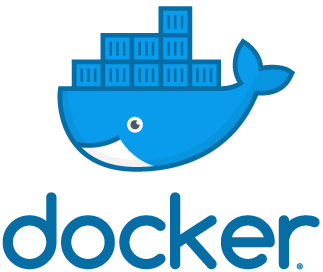
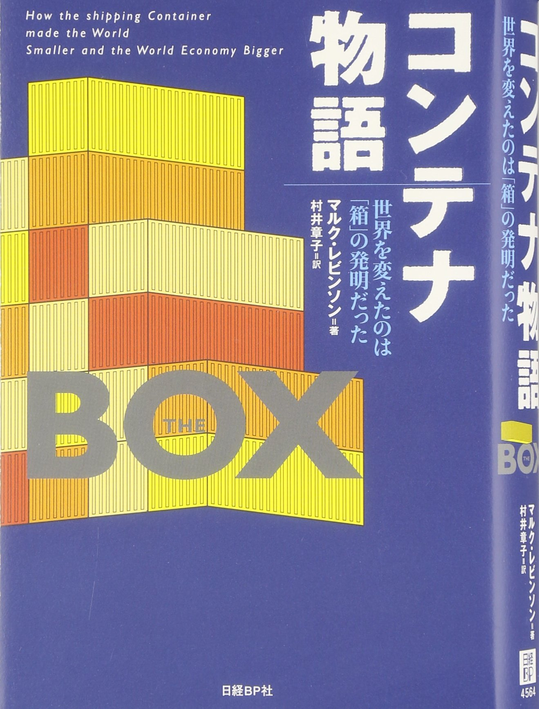

# コンテナ物語

---

## コンテナ物語

コンテナの話をします

---

## コンテナって

  

---

## ではなく

---

## コンテナ物語

  

物流コンテナの話をします

---

## コンテナ以前
- 海運のネック：荷役(にやく)
  - コストの30%を占める
  - 大型船(当時)で10日-20日
  - 行程の半分が停泊
- 荷役を行う沖仲仕(おきなかし)
  - 沖仲仕のストライキ
  - 沖仲仕による盗み・高額な保険料
- 政府の支援による価格カルテル

---

## コンテナ以降
- クレーンによる荷役
  - 港への停泊は最長1日
- 沖仲仕の消滅
- 保険料90%オフ
- 定時制の確保
- 投資価格増大
- 価格競争の激化
  - 海運業界の寡占化

---

## コンテナ港
- 大型船が停泊可能な大きさ深さ
- 大型クレーン
- 広大なコンテナヤード
- 大量の荷物を輸送する鉄道網高速道路網
- 寄港地の減少・集約
- 莫大な投資額・民営化
- 消費地から遠い郊外への移転
  - ロンドン衰退(郊外移転
  - ロッテルダムの復興
  - シンガポールの国策と大躍進

---

## 輸送機関の連携
- コンテナ積み替えはNG
- コンテナの規格化
- 大陸横断鉄道の躍進・パナマの衰退

---

## 産業の変化
- 日本・中国製品が世界を席巻
  - 加工貿易の発展
- ジャストインタイムの発明
